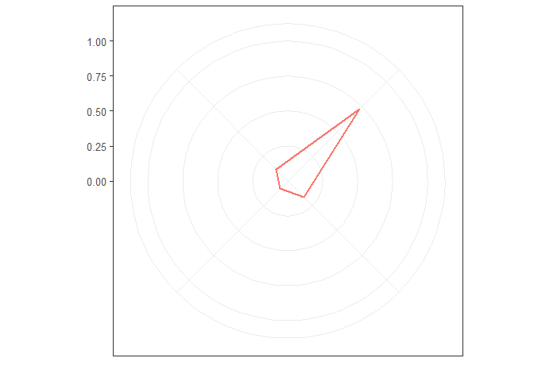
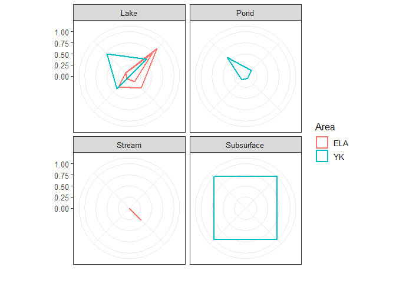

# Composition Wheel Template

Here you will find the code to create your own Composition Wheel. Feel
free to swap out parameters with what you like (just be sure to
‘normalize’ the values as scale between 0 and 1 based on the max and
min in the dataset).

## Load required libraries and dataset

``` r
library(ggplot2)
library(reshape2)

#Dataset
DOM_CW <- read.csv('test_dataset.csv')
```

## Set up the Composition Wheel

Scale all parameters to form 4 axes with values from 0 to 1 (the min and
max of that parameter in the dataset).

``` r
DOM_CW.scaled <- na.omit(DOM_CW)   #remove any 'NA

DOM_CW.scaled$HS.      <- ( (DOM_CW.scaled$HS.)     - min(DOM_CW.scaled$HS.) )     / (max(DOM_CW.scaled$HS.)     - min(DOM_CW.scaled$HS.) )
DOM_CW.scaled$DOC.DON  <- ( (DOM_CW.scaled$DOC.DON) - min(DOM_CW.scaled$DOC.DON) ) / (max(DOM_CW.scaled$DOC.DON) - min(DOM_CW.scaled$DOC.DON) )
DOM_CW.scaled$SUVA     <- ( (DOM_CW.scaled$SUVA)    - min(DOM_CW.scaled$SUVA) )    / (max(DOM_CW.scaled$SUVA)    - min(DOM_CW.scaled$SUVA) )
DOM_CW.scaled$S275     <- ( (DOM_CW.scaled$S275)    - min(DOM_CW.scaled$S275) )    / (max(DOM_CW.scaled$S275)    - min(DOM_CW.scaled$S275) )

#Melt the newly scaled database based on identification parameters:
DOM_CW.scaled <- melt(DOM_CW.scaled, id.vars = c('Area','Type','Sample','DOC_mg.L'))

#Create a radial coordinate system with closed points and linear lines
#Taken from Erwan Le Pennec (2016):
#http://www.cmap.polytechnique.fr/~lepennec/R/Radar/RadarAndParallelPlots.html

coord_radar <- function (theta = "x", start = 0, direction = 1) 
{
  theta <- match.arg(theta, c("x", "y"))
  r <- if (theta == "x") 
    "y"
  else "x"
  ggproto("CordRadar", CoordPolar, theta = theta, r = r, start = start, 
          direction = sign(direction),
          is_linear = function(coord) TRUE)
}
```

## Plot the Composition Wheel

### Single Sample

``` r
ggplot(DOM_CW.scaled, aes(x=variable, y=value))+
  geom_polygon(data=subset(DOM_CW.scaled, Sample == 'L123'),
               aes(group=Sample, colour=Area),
               fill= NA,
               size=1)+
  xlab("")+
  ylab("")+
  guides(colour='none')+
  scale_y_continuous(limits=c(0,1),
                     breaks = c(0, 0.25, 0.5, 0.75, 1))+
  theme_bw(base_size = 12)+
  theme(panel.background = element_blank(),
        plot.background = element_blank(),
        axis.text.x = element_blank())+
  coord_radar()
```

<!-- -->
\#\#\# Series of Composition Wheels  
Note the facet\_wrap() to allow this.

``` r
ggplot(DOM_CW.scaled, aes(x=variable, y=value))+
  geom_polygon(aes(group=interaction(Sample,Area), colour=Area),
               fill= NA,
               size=1)+
  xlab("")+
  ylab("")+
  scale_y_continuous(limits=c(0,1),
                     breaks = c(0, 0.25, 0.5, 0.75, 1))+
  facet_wrap(.~Type)+
  theme_bw(base_size = 12)+
  theme(panel.background = element_blank(),
        plot.background = element_blank(),
        axis.text.x = element_blank())+
  coord_radar()
```

<!-- -->
