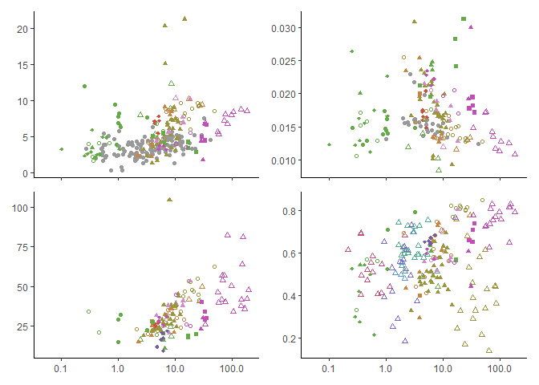
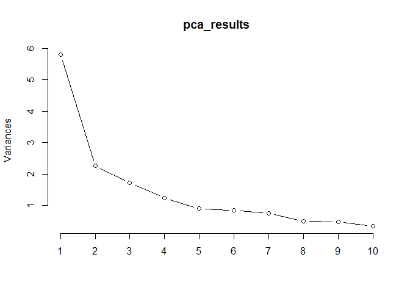
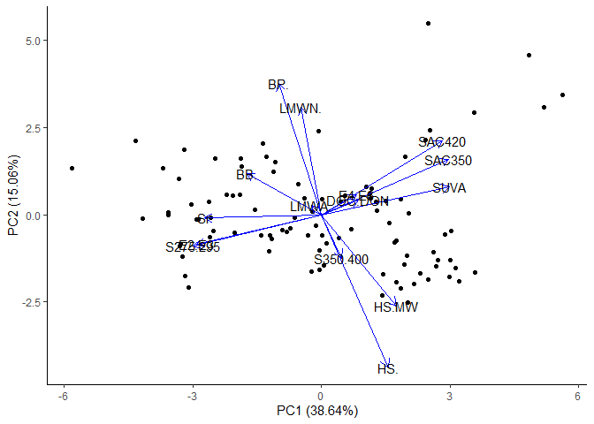
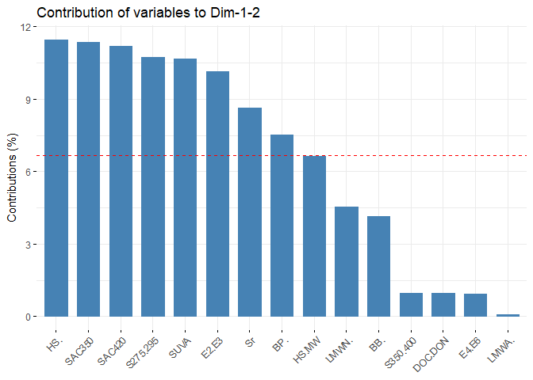
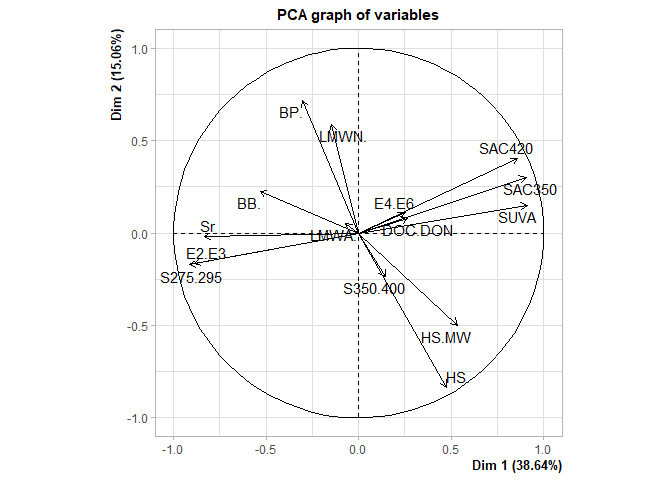
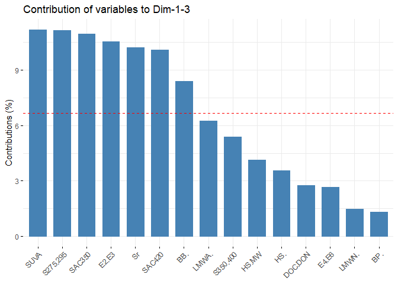
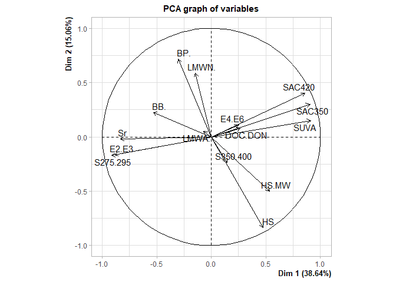
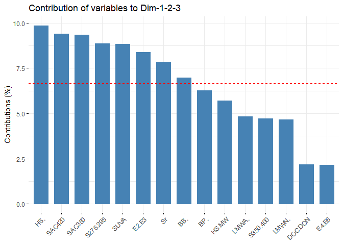

# Figures and Stats

## Load Libraries and Data

``` r
library(tidyverse)
```

    ## -- Attaching packages --------------------------------------- tidyverse 1.3.0 --

    ## v ggplot2 3.3.2     v purrr   0.3.4
    ## v tibble  3.0.4     v dplyr   1.0.2
    ## v tidyr   1.1.2     v stringr 1.4.0
    ## v readr   1.4.0     v forcats 0.5.0

    ## -- Conflicts ------------------------------------------ tidyverse_conflicts() --
    ## x dplyr::filter() masks stats::filter()
    ## x dplyr::lag()    masks stats::lag()

``` r
library(ggfortify)
library(patchwork)
library(reshape2)
```

    ## 
    ## Attaching package: 'reshape2'

    ## The following object is masked from 'package:tidyr':
    ## 
    ##     smiths

``` r
library(FactoMineR)
library(factoextra)
```

    ## Welcome! Want to learn more? See two factoextra-related books at https://goo.gl/ve3WBa

``` r
### Figure 2 Data ###
#Import all data
DOM_compare <- read.csv("Aukes_Schiff_DOMcompare.csv")

#Now averaging so one value per site
DOM_compare <- DOM_compare %>%
  select(Location, Hydro, Area, Site, Env,
         DOC_mg.L, SUVA,S275.295, DOC.DON,HS.,BP., LMWN.) %>%
  group_by(Env, Location, Hydro, Area, Site) %>%
  summarise_all(mean, na.rm=TRUE) %>%
  ungroup()

#Import literature dataset
spencer<- read.csv("spencer et al 2012.csv")
jaffe<- read.csv("jaffe et al 2008.csv")


### Figure 3 PCA Data ###
#import data (all samples that have all DOM measures)
all_pca_dom <- read.csv("Aukes_Schiff_PCA.csv")

#average by Site:
all_pca_dom <- all_pca_dom %>%
  select(-Date, -Year, -Month, -Env) %>%
  group_by(Location, Area, Hydro, SampleID) %>%
  summarise_all(mean) %>%
  ungroup()

#normalize LC-OCD proportions to fraction eluted
all_pca_dom$BP. <- all_pca_dom$BP/all_pca_dom$Hphi
all_pca_dom$HS. <- all_pca_dom$HS/all_pca_dom$Hphi
all_pca_dom$BB. <- all_pca_dom$BB/all_pca_dom$Hphi
all_pca_dom$LMWN. <- all_pca_dom$LMWN/all_pca_dom$Hphi
all_pca_dom$LMWA. <- all_pca_dom$LMWA/all_pca_dom$Hphi
```

## Figure 1 - Site Map

This was created in Adobe Illustrator CS6.

## Figure 2 - DOM Composition Measures vs DOM Concentration

``` r
fig2a<-
  ggplot(subset(DOM_compare, !is.na(DOC_mg.L)), aes(DOC_mg.L, SUVA))+
  geom_point(data = spencer, aes(x= DOC, y = SUVA), colour= "grey60", shape=16)+
  geom_point(data = jaffe, aes(x= DOC, y = SUVA), colour= "grey60", shape=16)+
  geom_point(aes(colour=Location, shape=Hydro))+
  scale_x_log10(limits=c(0.05,200), breaks=c(0.1,1,10,100))+
  scale_colour_manual(values=c("#c45078",
                               "#cc5143",
                               "#c98442",
                               "#9a963f",
                               "#64ac48",
                               "#4aac8b",
                               "#5f98d7",
                               "#7b68d8",
                               "#765ca1",
                               "#d18bc8",
                               "#c24fb6"))+
  scale_shape_manual(values=c(1,17,15,18,16,2))+
  theme_classic()+
  theme(panel.grid = element_blank(),
        axis.text.x = element_blank(),
        axis.title = element_blank(),
        legend.position = "none")

fig2b<-
  ggplot(subset(DOM_compare, !is.na(DOC_mg.L)), aes(DOC_mg.L, S275.295))+
  geom_point(data = spencer, aes(x= DOC, y = s275.295*10^-3), colour= "grey60", shape=16)+
  geom_point(aes(colour=Location, shape=Hydro))+
  scale_x_log10(limits=c(0.05,200), breaks=c(0.1,1,10,100))+
  scale_colour_manual(values=c("#c45078",
                               "#cc5143",
                               "#c98442",
                               "#9a963f",
                               "#64ac48",
                               "#4aac8b",
                               "#5f98d7",
                               "#7b68d8",
                               "#765ca1",
                               "#d18bc8",
                               "#c24fb6"))+
  scale_shape_manual(values=c(1,17,15,18,16,2))+
  theme_classic()+
  theme(panel.grid = element_blank(),
        axis.text.x = element_blank(),
        axis.title = element_blank(),
        legend.position = "none")


fig2c<-
  ggplot(subset(DOM_compare, !is.na(DOC_mg.L)), aes(DOC_mg.L, DOC.DON))+
  geom_point(aes(colour=Location, shape=Hydro))+
  scale_x_log10(limits=c(0.05,200), breaks=c(0.1,1,10,100))+
  scale_colour_manual(values=c("#c45078",
                               "#cc5143",
                               "#c98442",
                               "#9a963f",
                               "#64ac48",
                               "#4aac8b",
                               "#5f98d7",
                               "#7b68d8",
                               "#765ca1",
                               "#d18bc8",
                               "#c24fb6"))+
  scale_shape_manual(values=c(1,17,15,18,16,2))+
  theme_classic()+
  theme(panel.grid = element_blank(),
        axis.title = element_blank(),
        legend.position = "none")

fig2d<-
  ggplot(subset(DOM_compare, !is.na(DOC_mg.L)), aes(DOC_mg.L, HS.))+
  geom_point(aes(colour=Location, shape=Hydro))+
  scale_x_log10(limits=c(0.05,200), breaks=c(0.1,1,10,100))+
  scale_colour_manual(values=c("#c45078",
                               "#cc5143",
                               "#c98442",
                               "#9a963f",
                               "#64ac48",
                               "#4aac8b",
                               "#5f98d7",
                               "#7b68d8",
                               "#765ca1",
                               "#d18bc8",
                               "#c24fb6"))+
  scale_shape_manual(values=c(1,17,15,18,16,2))+
  theme_classic()+
  theme(panel.grid = element_blank(),
        axis.title = element_blank(),
        legend.position = "none")

(fig2a / fig2c) | (fig2b / fig2d) 
```

<!-- -->

## Figure 3 - PCA

``` r
#Scale all data
scaled_pca<- as.data.frame(scale(subset(all_pca_dom, select=c("DOC.DON","BP.","HS.","BB.","LMWN.","LMWA.","SUVA","E2.E3","E4.E6","SAC350","S275.295","S350.400","Sr","SAC420","HS.MW"))))

#Run the PCA
pca_results <- prcomp(scaled_pca, center=TRUE, scale.=FALSE)

#View the results
summary(pca_results)
```

    ## Importance of components:
    ##                           PC1    PC2    PC3     PC4     PC5     PC6     PC7
    ## Standard deviation     2.4075 1.5030 1.3146 1.11025 0.94896 0.91906 0.86638
    ## Proportion of Variance 0.3864 0.1506 0.1152 0.08218 0.06004 0.05631 0.05004
    ## Cumulative Proportion  0.3864 0.5370 0.6522 0.73439 0.79443 0.85074 0.90078
    ##                            PC8    PC9    PC10    PC11    PC12    PC13    PC14
    ## Standard deviation     0.70298 0.6939 0.58050 0.31182 0.21237 0.16159 0.08075
    ## Proportion of Variance 0.03295 0.0321 0.02246 0.00648 0.00301 0.00174 0.00043
    ## Cumulative Proportion  0.93373 0.9658 0.98829 0.99477 0.99778 0.99952 0.99996
    ##                           PC15
    ## Standard deviation     0.02583
    ## Proportion of Variance 0.00004
    ## Cumulative Proportion  1.00000

``` r
screeplot(pca_results, type="lines")
```

<!-- -->

``` r
#Create Graph
autoplot(pca_results, scale = 0,
         data=all_pca_dom,
         loadings=TRUE, loadings.colour='blue',
         loadings.label=TRUE, loadings.label.colour='black')+
  theme_classic()
```

<!-- -->

## Figure 4 - DOM Composition Wheel

``` r
# Creating Composition Wheel Dataset from PCA dataset (has all data with all values and select hydro env)
all_dom_cw <- all_pca_dom %>%
  select("SampleID", "Location","DOC_mg.L", "Area","Hydro", "S275.295", "HS.", "SUVA", "DOC.DON") %>%
  filter(Hydro == "Seep" | Hydro == "Sub"| Hydro == "Pond" |Hydro =="Lake" |Hydro =="Creek"|Hydro == "River")

#remove any 'NA'
all_dom_cw_scaled <- na.omit(all_dom_cw)   

#order the hydro and location
all_dom_cw_scaled$Hydro <- factor(all_dom_cw_scaled$Hydro, levels =c("Seep", "Sub","Pond","Lake","Creek", "River"))
all_dom_cw_scaled$Location <- factor(all_dom_cw_scaled$Location, levels = c("Hazen","Daring","Wek'weeti","Yellowknife","ELA"))

#scale the axes from values of 0-1 based on dataset
all_dom_cw_scaled$HS.      <- ( (all_dom_cw_scaled$HS.)     - min(all_dom_cw_scaled$HS.) )     / (max(all_dom_cw_scaled$HS.)     - min(all_dom_cw_scaled$HS.) )
all_dom_cw_scaled$DOC.DON  <- ( (all_dom_cw_scaled$DOC.DON) - min(all_dom_cw_scaled$DOC.DON) ) / (max(all_dom_cw_scaled$DOC.DON) - min(all_dom_cw_scaled$DOC.DON) )
all_dom_cw_scaled$SUVA     <- ( (all_dom_cw_scaled$SUVA)    - min(all_dom_cw_scaled$SUVA) )    / (max(all_dom_cw_scaled$SUVA)    - min(all_dom_cw_scaled$SUVA) )
all_dom_cw_scaled$S275.295 <- ( (all_dom_cw_scaled$S275.295)- min(all_dom_cw_scaled$S275.295) )/ (max(all_dom_cw_scaled$S275.295)- min(all_dom_cw_scaled$S275.295) )

all_dom_cw_scaled$SampleID = factor(all_dom_cw_scaled$SampleID)

all_dom_cw_scaled <- melt(all_dom_cw_scaled, id.vars = c("Location","Hydro","Area", "SampleID","DOC_mg.L"))

#Create a radial coordinate system with closed points and linear lines
#Taken from Erwan Le Pennec (2016):
#http://www.cmap.polytechnique.fr/~lepennec/R/Radar/RadarAndParallelPlots.html

coord_radar <- function (theta = "x", start = 0, direction = 1) 
{
  theta <- match.arg(theta, c("x", "y"))
  r <- if (theta == "x") 
    "y"
  else "x"
  ggproto("CordRadar", CoordPolar, theta = theta, r = r, start = start, 
          direction = sign(direction),
          is_linear = function(coord) TRUE)
}

#Create Plot
ggplot(all_dom_cw_scaled, aes(x = variable, y = value)) +
  geom_polygon(aes(group=interaction(SampleID,Area), color = Hydro), fill = NA, size = 1) +
  facet_grid(Location~Hydro)+
  xlab("") + ylab("") +
  guides(color = "none") +
  scale_y_continuous(limits=c(0,1), breaks = c(0, 0.25, 0.5, 0.75, 1))+
  scale_colour_manual(values=c("#ca5b49",
                               "#b68f40",
                               "#70a845",
                               "#4aad92",
                               "#8475ca",
                               "#ca5796"))+
  theme_bw(base_size = 12)+
  theme(panel.background = element_blank(),
        plot.background = element_blank(),
        axis.text = element_blank())+
  coord_radar()
```

<!-- -->

## Figures 5 - 7

These figures were created in Adobe Illustrator CS6. Figure 5 was based
on ‘Final - Initial’ changes to DOM composition based on photolytic and
microbial degradation experiments (Aukes et al. *in prep.*).

## Suppl. Fig 1 - Contribution of Variables to Different PC Axes

``` r
fviz_contrib(PCA(all_pca_dom %>%
                   select(DOC.DON, BP., HS., HS.MW, BB., LMWN., LMWA., SUVA, E2.E3, E4.E6, SAC350, S275.295, S350.400, Sr, SAC420) ,
                 scale.unit = TRUE, 
                 ncp = 5, 
                 graph = TRUE),
             choice = "var",
             axes = 1:2,
             top = 20)
```

<!-- --><!-- --><!-- -->

``` r
fviz_contrib(PCA(all_pca_dom %>%
                   select(DOC.DON, BP., HS., HS.MW, BB., LMWN., LMWA., SUVA, E2.E3, E4.E6, SAC350, S275.295, S350.400, Sr, SAC420) ,
                 scale.unit = TRUE, 
                 ncp = 5, 
                 graph = TRUE),
             choice = "var",
             axes = c(1,3),
             top = 20)
```

<!-- --><!-- --><!-- -->

``` r
fviz_contrib(PCA(all_pca_dom %>%
                   select(DOC.DON, BP., HS., HS.MW, BB., LMWN., LMWA., SUVA, E2.E3, E4.E6, SAC350, S275.295, S350.400, Sr, SAC420) ,
                 scale.unit = TRUE, 
                 ncp = 5, 
                 graph = TRUE),
             choice = "var",
             axes = 1:3,
             top = 20)
```

<!-- --><!-- --><!-- -->
